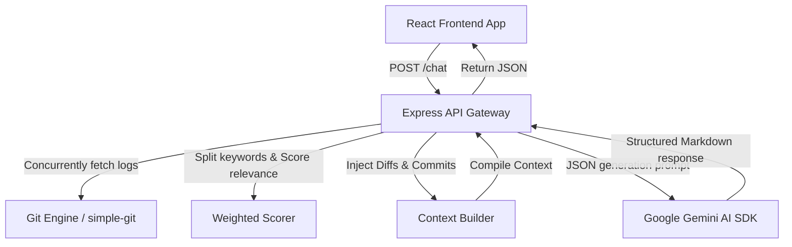

# TraceMind 🔍

TraceMind is a premium, AI-powered Git repository investigator designed to help software engineers navigate large codebases, analyze complex commit streams, and discover the root causes of bugs using natural language queries.

---

## Architecture Flow



---

## Workspace Structure

TraceMind is structured as a TypeScript monorepo managed via `pnpm`:

```
├── apps
│   ├── api          # Express backend (Git service, RAG engine, Gemini AI)
│   └── web          # React frontend (Timeline logs, Interactive AI Chat)
├── packages
│   └── shared       # Shared TypeScript schemas, interfaces, and types
├── ai               # Development specifications and tasks
└── pnpm-workspace.yaml
```

---

## Local Development Quickstart

### 1. Prerequisites
- [Node.js](https://nodejs.org/) (v18 or higher)
- [pnpm](https://pnpm.io/) (v8 or higher)
- [Git](https://git-scm.com/) installed locally

### 2. Configuration Setup
Create a `.env` configuration file in `apps/api/.env` matching the template:
```env
# apps/api/.env
PORT=3001
GEMINI_API_KEY=your-gemini-api-key-here
```
> 🔑 **API Key:** Get a free Google Generative AI API key at [Google AI Studio](https://aistudio.google.com/apikey).

### 3. Install Dependencies
From the repository root folder, install monorepo packages:
```bash
pnpm install
```

### 4. Start Development Servers
Spin up the hot-reloading dev environment:
```bash
pnpm dev
```
- **Web App:** [http://localhost:5173/](http://localhost:5173/)
- **API Server:** [http://localhost:3001/](http://localhost:3001/)

---

## Production Deployment

### 1. Production Build compilation
Compile all TS files and bundle the React web static app using Vite:
```bash
pnpm build
```

### 2. Start Production Server
Launch compiled API listeners:
```bash
pnpm start
```

---

## Automated Test Suites

We use [Vitest](https://vitest.dev/) to run automated tests. Run backend route and service test suites:
```bash
pnpm --filter @tracemind/api test
```

---

## Running the Demo Investigation

To instantly explore TraceMind's features:
1. Ensure both dev servers are running (`pnpm dev`).
2. Open **[http://localhost:5173/repositories](http://localhost:5173/repositories)** in your web browser.
3. Under **Import Local Directory**, enter the absolute path of this repository:
   `/Users/nayemuddinshaikh/Desktop/Coding/Ai/TraceSpark`
4. Click **Import Repository**. It will index and list it under the Active Workspace.
5. Navigate to the **[AI Investigation](http://localhost:5173/investigate)** page.
6. Click one of the suggested prompts (e.g. *"Explain the changes in the latest commits."*) or ask a custom question. The Gemini-powered RAG pipeline will scan the commit logs, rank relevance, and output a structured answer alongside interactive evidence cards.

