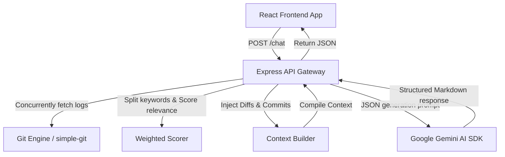
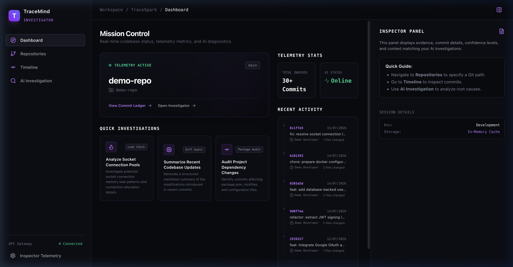
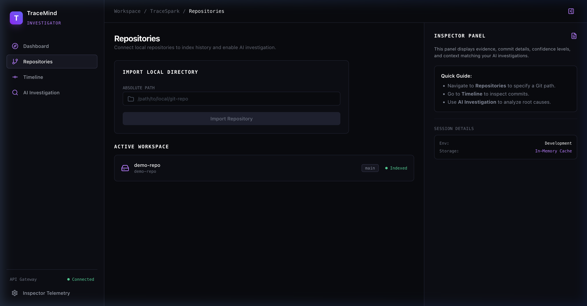
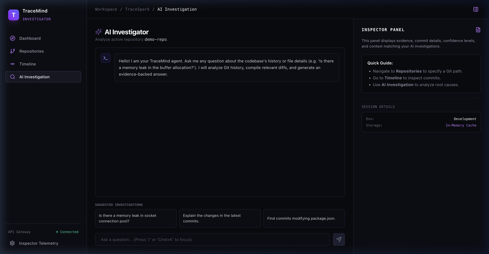
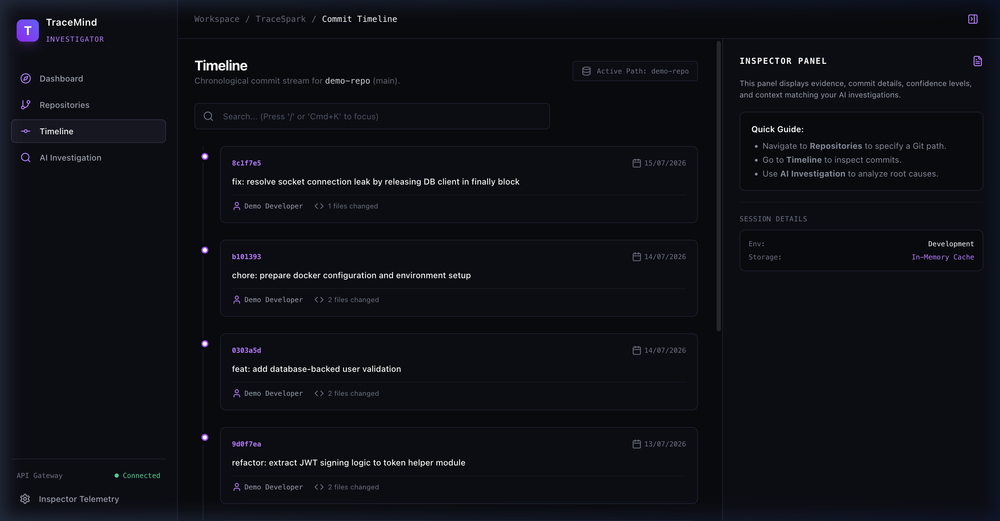

# TraceMind 🔍

### AI-Powered Codebase Diagnostics & Forensics Platform


TraceMind is a premium, AI-powered Git repository investigator designed to help software engineers navigate large codebases, analyze complex commit streams, and discover the root causes of regressions and bugs using natural language queries.

---

## 💡 The Problem

When a production incident occurs—such as database connection exhaustion or memory leaks—developers are forced to manually sift through hundreds of commits, compare complex diff files, and guess where the regression was introduced. 

This process leads to:
* **High MTTR (Mean Time to Resolution)**: Critical downtime is spent hunting for code changes.
* **Cognitive Fatigue**: Engineers waste hours reading raw logs and diff files instead of writing fixes.
* **Siloed Knowledge**: Git history remains opaque and unqueryable, meaning only senior engineers who remember the changes can quickly identify issues.

---

## ✨ The Solution

TraceMind transforms raw Git history into structured, queryable diagnostic telemetry. 

By utilizing a local RAG (Retrieval-Augmented Generation) pipeline, TraceMind indexes the commits, scores relevance against queries, and uses the Google Gemini AI SDK to analyze code diffs. It returns a structured **Forensic Investigation Report** that explains exactly when, how, and why a regression occurred, accompanied by the precise line-level evidence.

---

## 🚀 Key Features

* **🧠 AI Investigator**: Interact with your Git history using natural language queries (e.g., *"Why did user authentication start failing this week?"*).
* **⚡ Live RAG Telemetry Console**: Watch the AI engine process files, rank commits, and build context in real-time.
* **📅 Interactive History Ledger**: A beautiful chronological timeline showing commit logs with search highlighting and metadata.
* **🔍 Evidence Diff Viewer**: Lazy-loaded diff previews that highlight regression code blocks and subsequent fixes side-by-side.
* **📁 Multi-Workspace Hub**: Instantly import, index, and switch between local repositories by path.
* **💎 Premium UI**: Built with rich, dark-mode styling, smooth Framer Motion animations, and custom dashboard metrics.

---

## 🏗️ Architecture

TraceMind uses a clean, modular TypeScript monorepo architecture:

```
├── apps
│   ├── api          # Express backend (Git service, RAG engine, Gemini AI)
│   └── web          # React frontend (Timeline logs, Interactive AI Chat)
├── packages
│   └── shared       # Shared TypeScript schemas, interfaces, and types
```

### Request and Data Flow



1. **Git Engine**: Interfaces with local repositories using `simple-git` to extract logs, authors, diffs, and blames.
2. **Weighted Scorer**: Processes the query to rank commits based on term frequency, commit messages, and affected file paths.
3. **Context Builder**: Truncates and formats the highest-ranked commit diffs to compile a compact, token-efficient prompt.
4. **AI Engine**: Sends the structured context to Gemini and parses the response into interactive UI evidence cards.

---

## 💻 Tech Stack

### Frontend
* **UI Library**: [React 19](https://react.dev/)
* **Build System**: [Vite](https://vite.dev/)
* **Language**: [TypeScript](https://www.typescriptlang.org/)
* **Styling**: [TailwindCSS v4](https://tailwindcss.com/)
* **State Management**: [TanStack Query v5](https://tanstack.com/query/latest)
* **Routing**: [React Router v7](https://react.router.com/)
* **Animations**: [Framer Motion](https://www.framer.com/motion/)
* **Icons**: [Lucide React](https://lucide.dev/)

### Backend
* **Runtime**: [Node.js 22+](https://nodejs.org/)
* **Framework**: [Express](https://expressjs.com/)
* **Git Access**: [simple-git](https://github.com/steveukx/node-simple-git)
* **Validation**: [Zod](https://zod.dev/)
* **AI Integration**: [Google Gemini AI SDK](https://ai.google.dev/gemini-api/docs) / [OpenAI SDK](https://github.com/openai/openai-node)

### Tooling
* **Package Manager**: [pnpm](https://pnpm.io/) (Workspaces)
* **Testing**: [Vitest](https://vitest.dev/)

---

## 📸 Screenshots

<table width="100%">
  <tr>
    <td width="50%">
      <p align="center"><b>📊 Dashboard Dashboard</b></p>
      
    </td>
    <td width="50%">
      <p align="center"><b>📂 Repositories Hub</b></p>
      
    </td>
  </tr>
  <tr>
    <td width="50%">
      <p align="center"><b>🔍 AI Investigation</b></p>
      
    </td>
    <td width="50%">
      <p align="center"><b>📅 Commit Timeline</b></p>
      
    </td>
  </tr>
</table>

---

## ⚙️ Setup & Installation

### 1. Prerequisites
* **Node.js** (v18 or higher)
* **pnpm** (v8 or higher)
* **Git** installed on your system

### 2. Environment Configuration
Create a `.env` configuration file in [apps/api/.env](file:///Users/nayemuddinshaikh/Desktop/Coding/Ai/TraceSpark/apps/api/.env) matching the template:
```env
PORT=3001
GEMINI_API_KEY=your-gemini-api-key-here
```
> 🔑 **API Key**: Get a free Google Generative AI API key at [Google AI Studio](https://aistudio.google.com/apikey).

### 3. Install Dependencies
From the repository root folder, install the workspace packages:
```bash
pnpm install
```

### 4. Start Development Servers
Spin up both the React frontend and the Express backend in hot-reloading dev mode:
```bash
pnpm dev
```
* **Web Client**: [http://localhost:5173/](http://localhost:5173/)
* **API Server**: [http://localhost:3001/](http://localhost:3001/)

### 5. Running Tests
Run backend API and utility tests:
```bash
pnpm --filter @tracemind/api test
```

---

## 🎬 Demo walkthrough

A pre-packaged demonstration repository is provided at `./demo-repo` simulating a production socket database leak incident.

To run the demo:
1. Ensure both development servers are active (`pnpm dev`).
2. Open the **Repositories** page at [http://localhost:5173/repositories](http://localhost:5173/repositories).
3. Under **Import Local Directory**, input the absolute path to the demo repo:
   ```text
   /Users/nayemuddinshaikh/Desktop/Coding/Ai/TraceSpark/demo-repo
   ```
4. Click **Import Repository** to index the codebase.
5. Head over to the **AI Investigation** tab.
6. Submit the query:
   ```text
   Is there a memory leak in socket connection pool?
   ```
7. Watch the **RAG Telemetry** console stream keywords, scores, and code frames.
8. Inspect the returned **Investigation Report** pointing to commit `b3a9c40` (*"feat: add database-backed user validation"*) where a DB socket client was initialized but never released.
9. Click **Show Diff Preview** to see the offending code block and locate its fix in a subsequent commit.

---

## 🔮 Future Scope

* **⚡ Semantic Commit Search**: Integrate a vector database (e.g. PostgreSQL with `pgvector`) to perform embeddings-based semantic code and commit search.
* **🤖 Local LLM Support**: Enable offline local analysis using models like Llama 3 or Mistral via Ollama.
* **🛡️ CI/CD Gatekeeper**: Build GitHub Actions integration to automatically audit commit diffs during PRs for potential architectural or resource leaks.
* **🌐 Enterprise Integrations**: Direct GitHub/GitLab webhooks to ingest commits asynchronously from remote repositories.
